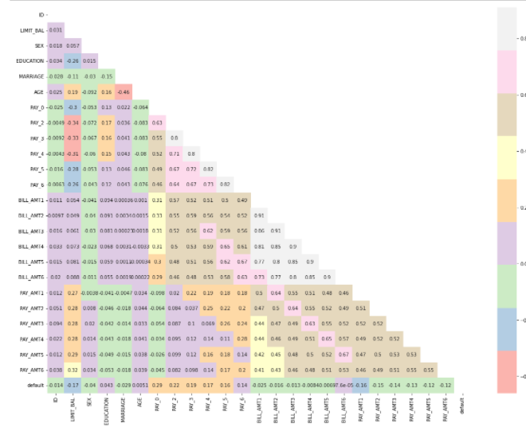
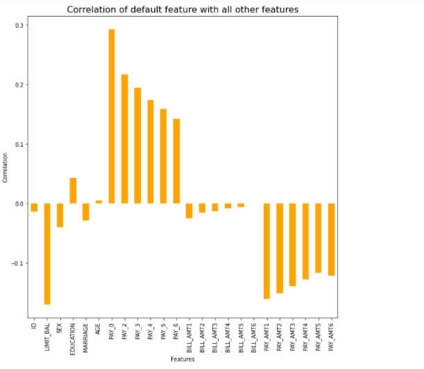
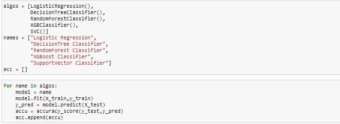
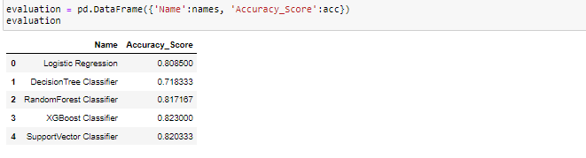
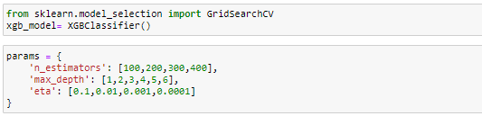
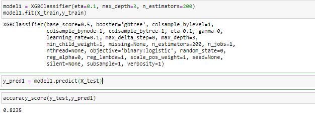
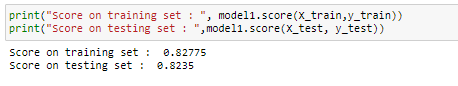
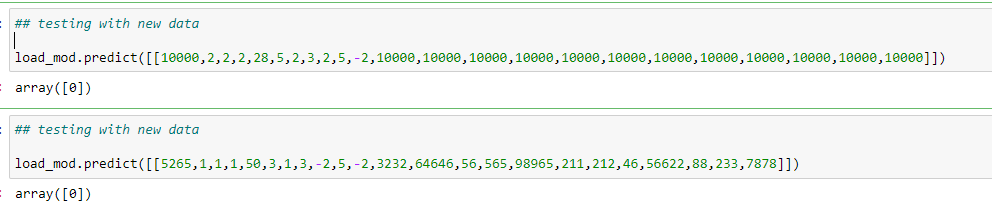

# Credit_Card_Default_Prediction

#### I collected the dataset from [Kaggle](https://www.kaggle.com/officialsubhash/credit-card-defaulters-analysis/data).

## Problem Statement :
     
     Financial threats are displaying a trend about the credit risk of commercial banks as the incredible improvement in the financial industry has arisen. 
     In this way, one of the biggest threats faces by commercial banks is the risk prediction of credit clients. 
     The goal is to predict the probability of credit default based on credit card owner's characteristics and payment history.

## Dataset Descriprion:

The UCI_Credit_Card.csv dataset contains 25 columns :

     1. ID: ID of each client

     2. LIMIT_BAL: Amount of given credit in NT dollars (includes individual and family/supplementary credit

     3. SEX: Gender (1=male, 2=female)

     4. EDUCATION: (1=graduate school, 2=university, 3=high school, 4=others, 5=unknown, 6=unknown)

     5. MARRIAGE: Marital status (1=married, 2=single, 3=others)

     6. AGE: Age in years

     7. PAY_0: Repayment status in September, 2005 (-1=pay duly, 1=payment delay for one month, 2=payment delay for two months, … 8=payment delay for eight months, 9=payment delay for nine months and above)

     8. PAY_2: Repayment status in August, 2005 (scale same as PAY_0)

     9. PAY_3: Repayment status in July, 2005 (scale same as PAY_0)

     10. PAY_4: Repayment status in June, 2005 (scale same as PAY_0)

     11. PAY_5: Repayment status in May, 2005 (scale same as PAY_0)

     12. PAY_6: Repayment status in April, 2005 (scale same as PAY_0)

     13. BILL_AMT1: Amount of bill statement in September, 2005 (NT dollar)

     14. BILL_AMT2: Amount of bill statement in August, 2005 (NT dollar)

     15. BILL_AMT3: Amount of bill statement in July, 2005 (NT dollar)

     16. BILL_AMT4: Amount of bill statement in June, 2005 (NT dollar)

     17. BILL_AMT5: Amount of bill statement in May, 2005 (NT dollar)

     18. BILL_AMT6: Amount of bill statement in April, 2005 (NT dollar)

     19. PAY_AMT1: Amount of previous payment in September, 2005 (NT dollar)

     20. PAY_AMT2: Amount of previous payment in August, 2005 (NT dollar)

     21. PAY_AMT3: Amount of previous payment in July, 2005 (NT dollar)

     22. PAY_AMT4: Amount of previous payment in June, 2005 (NT dollar)

     23. PAY_AMT5: Amount of previous payment in May, 2005 (NT dollar)

     24. PAY_AMT6: Amount of previous payment in April, 2005 (NT dollar)

     25. default.payment.next.month: Default payment (1=yes, 0=no)
     
 
## Procedure followed for this experiment:
 
### 1. Dataset loading and preprocessing of dataset: 
       * At the very first imported some importany libraries 
       * These libraries are imported for data loading and preprocessing like pandas, seaborn, numpy etc.

### 2. EDA :
       * In this step i checked if there are any null values present.
       * What are the colums present and their datatypes unique values present in each column
       * Counting of different categories present in categorical features etc.
       
#### Based on the EDA ,we have come across some important points like :
       1. There are 77.88% people who have not pay the default and most of the females didnt pay.
       2. 46.76% of individual who were in university but didn't pay.
       3. Around 53.21% individuas who are single but did not pay.
       4. In september,2005 max repayment status is 49.12%
       5. In august max repayment status is 52.43% who have not paid the default and many more.
       
### 3. Feature Engineering and Feature Selection :

       * Here we have deleted the columns which are not important like ID.
       * Calculated the correlation between different features and also plotted a "Spearman" correltion matrix
       
   
   
       * Also we plotted a bargraph for the correlation values.
       
   
   
### 4. Training :
       * For training i separated the dataset using train test split.
       * Introduced a pipeline using different classification models.
       
   
   
       * Calculated the different metrices like accuracy score etc. 
       * Compared different classification model accuracy scores for the further process 
       
   
    
       * As the XGBoost Classifier gives best result so we are considering this XGBoost for the next Hyparameter tuning

### 5. Hyparameter Tuning using GridSearchCV :
       * As we have selected XGBoost classifier for the next processing so we will introduce some diffrerent parameters related to XGBoost classifier like:
          ** n_estimators
          ** max_depth
          ** eta
        * Using GridSearchCV I did the parameter tuning and again pass the training set to the XGBClassifier model
        
   
   
        * Again we calculated the accuracy score and different metrices
        
   
   
### 6. Model Performance testing using different metrices : 
        * After getting the model I calculated the accuracy score and different classification metrices like precision_score, recall_score etc.
        * Saved the model for future reference .
        
   
        
### 7. Testing the model :
        *  After loading the saved model, I created some test data to see the result.
        
   
             

## End !!!
        
       
       
       
       
       
